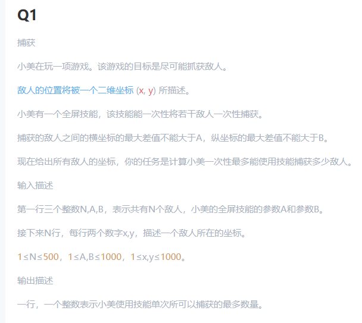

# 数学/数组

## 数学相关
1. [快速幂(常考题)](./myPow.py)  
   https://leetcode.cn/problems/powx-n/

## 数组操作
1. [顺时针打印矩阵](./spiralOrder.py)  
   https://leetcode.cn/problems/shun-shi-zhen-da-yin-ju-zhen-lcof/description/

## 前缀和

### 例题  
1. [前缀和例题(MT笔试真题)](./prefixSum.py)  
   