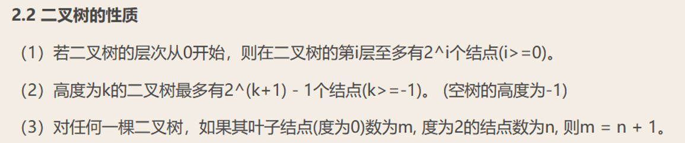
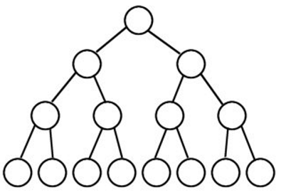
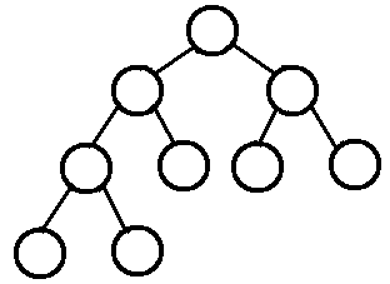
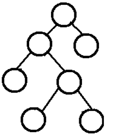
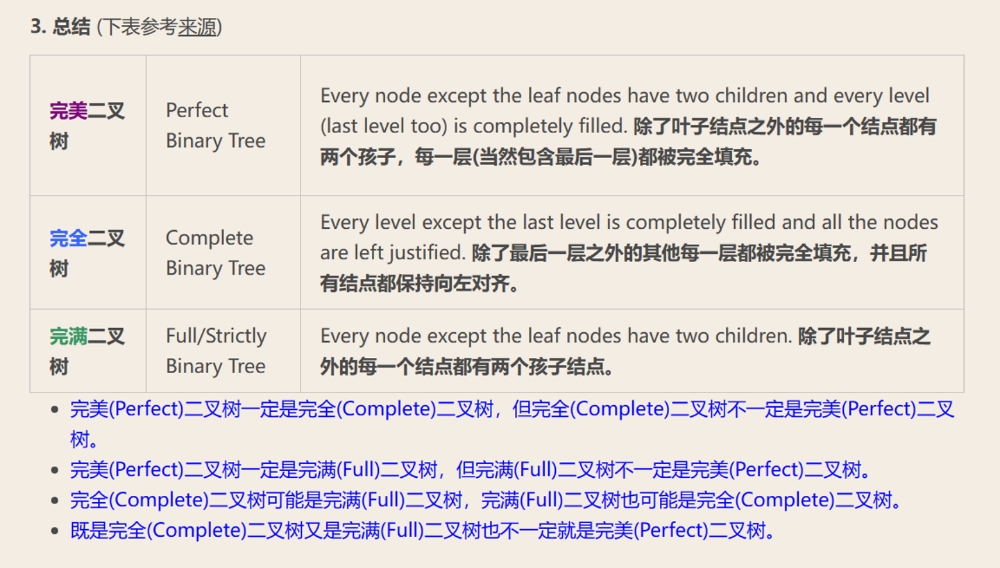

# 树

## 树 Tree
1. 定义  
树 是由结点或顶点和边组成的且不存在着任何环的一种数据结构。
没有结点的树称为空树，一棵非空的树包括一个根结点，可能有着多个附加结点，所有结点构成一个多级分层结构。

2. 术语  
根 Root，孩子 Child，双亲 Parent，兄弟 Sibling，祖先 Ancestor，子孙 Descent ant
叶子 Leaf，分支 Branch，度 Degree，边 Edge，路径 Path，层次 Level，高度 Height，深度 Depth，森林 Forest

## 二叉树（Binary Tree）
1. 定义  
    每个结点至多拥有两棵子树（即二叉树中不存在度大于2的结点），并且，二叉树的子树有左右之分

2. 性质
    

3. 相关定义
    完美二叉树（Perfect）：  
    一个深度为k(>=-1)且有2^(k+1)-1个结点的二叉树 （也称为满二叉树）  
      

    完全二叉树（Complete）:  
    从根结点到倒数第二层满足完美二叉树，最后一层可以不完全填充，其叶子结点都靠左对齐  
      

    完满二叉树（Full）：  
    所有非叶子结点的度都是2  
    

    

## 例题
1. [tree+DP](./tree+DP.py)  
   