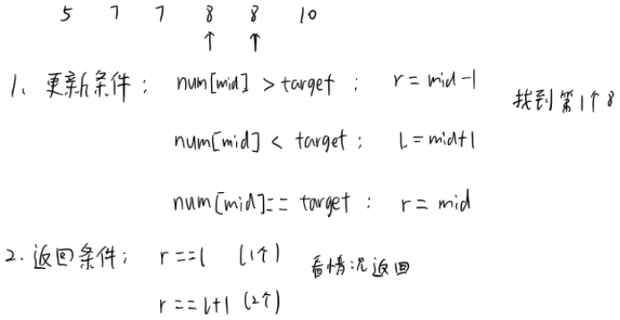

# 二分法

## 标准二分
[binarySearch](./binary.py)

## 使用二分法解题
实际笔试/面试中，往往会给出一个可以用二分查找，但是需要进行适当修改的二分法  
如何在经典二分的基础上快速写出不含bug的二分查找也是一个非常关键的问题  

二分关键点：
- 返回条件：经典二分找到元素时返回，但变形的返回条件往往更复杂，比如查询不到符合条件就返回
- 更新条件：经典二分满足大于/小于时 mid +/- 1，变形中的更新条件往往更多变

基本上把以上两个问题考虑清楚，一个正确的二分就能完成，实践中可以给出一个样例进行调试，可以帮助快速找到正确的返回/更新条件。

## 例题

1. [first二分/last二分](./firstBinarySearch)  
   https://leetcode.cn/problems/find-first-and-last-position-of-element-in-sorted-array/
   

   
3. [路灯最大间距(DiDi笔试真题)](example_didi.py)  
   你负责在一条笔直的道路上安装一些照明灯。但是道路上并不是任意位置都适合安装照明灯，具体地，假设将道路看作一条起点坐标为0，终点坐标为M的线段，那么只有在$x_1,x_2,...,x_n$这n个坐标可以安装照明灯，且每个坐标上最多只能安装一个照明灯。  
   现在你要在道路上安装k个照明灯，为了使照明灯能够尽量覆盖道路，你需要使距离最近的两个照明灯尽量远。请问这个最近距离最大可以是多少?  
   > 样例：  
   输入第一行为n和k，第二行为$x_1,x_2,...,x_n$  
   5 3  
   1 3 4 7 9  
   输出：  
   3

   二分查找：  
   可安装路灯的最小位置和最大位置分别为start和end  
   通过二分的方式，查找其中能够满足要求的最大阈值  
   二分，然后判断是否满足，进行更新，直至结束
