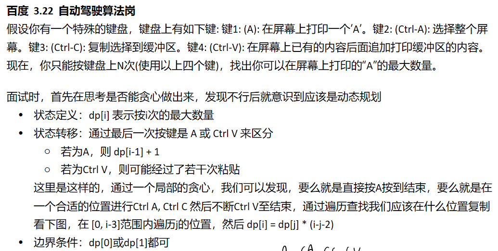

# 动态规划总结

## 动态规划&分治算法
动态规划与分治方法相似，都是通过组合子问题的解来求解原问题。  
与分治算法不同的是，动态规划应用于子问题重叠的情况，即不同的子问题具有公共的子子问题。  

这种情况下，分治算法会做许多不必要的工作，它会反复地求解那些公共子子问题，而动态规划只求解一次即将其保存在一个表格中，避免了这种不必要的计算工作。

一个明显的标志：分治算法往往采用递归的形式求解，而动态规划则不会递归，通过循环解决
递归时，每个子问题都要再次求解，而动态规划则是存储各个子问题，避免重复计算

## 动态规划4步曲
动态规划方法通常用来求解最优化问题 (optimizations problem)，这类问题可以有很多可行解，每个解都有一个值，我们希望寻找最优值的解，一个问题可能由多个最优解达到最优值。
我们通常按照4个步骤来设计一个动态规划算法
1. 刻画一个最优解的结构特征
2. 递归地定义最优解的值
3. 计算最优解的值，通常采用自底向上的方法
4. 利用计算出的信息构造一个最优解

## 动态规划解题技巧
动态规划法解题有点公式法的感觉  
状态定义，状态转移，边界状态三要素确定，直接相当于完成解题   
时空间复杂度由状态确定，代码写出来非常整齐漂亮。  

如何确定是否可以使用动态规划：  
关键：是否存在递推关系  
常见题型特点：计数，累加等  
 
常用状态定义：  
- 截至目前的最优解：最长回文数，最长公共子序列，最长上升子序列  
- 包含该点的解数：最大子序和，统计全为1的正方形子矩阵  
根据递推关系确定状态定义
边界条件一般较为简单。

目前主要是1维动态规划和2维动态规划，后者使用本身二维问题或两个一维的组合。

## 例题

1. [最大子数组和](./maxSubArray.py)  
   (https://leetcode.cn/problems/maximum-subarray/)

2. [四键键盘](./fourKeysKeyboard.py)
   

3. [统计打字数目](./countText.py)  
   https://leetcode.cn/problems/count-number-of-texts/
   
4. [股票系列1](./maxProfit.py)  
   [股票系列2](./maxProfit2.py)