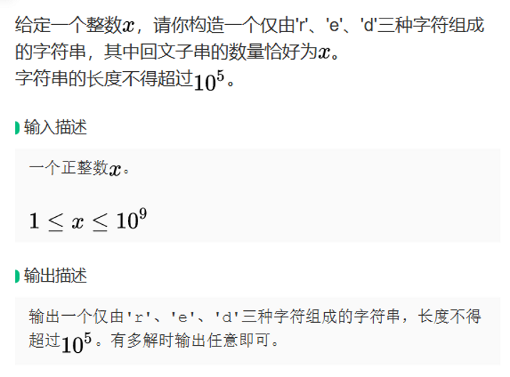

# 贪心算法
贪心的本质是选择每一阶段的局部最优，从而达到全局最优。

但是呢，贪心的题型并不像其他题型，有特征能够看出对应解法
贪心没有固定套路，唯一难点就是如何通过局部最优，推出整体最优。

如果遇到题，尝试进行手动模拟，如果可以模拟就试试贪心策略，如果不行有一定可能是dp的题  
- 数学归纳法
- 反证法

最好用的策略就是举反例，如果想不到反例，那么就试一试贪心吧。

大厂其实特别爱考贪心，感觉贪心的构造方法就是看你聪不聪明，没什么特别的技巧  
贪心没有解题套路，最优的规律往往涉及其他知识  
对于没有思路的题，多思考，看能不能发现规律，如果是贪心，一旦想明白就会发现很简单

## 例题
1. [red回文串(BD笔试真题)](./greedy_BD.py)  
   
   > 示例  
   > 输入 3  
   > 输出 red 或 dd
   
   思路：  
   构造回文串，范围最大 $10^9$ ，而输出字符长度最大 $10^5$  
   本题关键在于如何尽可能可控且节省长度地构造字符串  
   - 单个字符：ddd…d n个d，能产生n(n+1)/2个回文串
	- 两个字符：erer..er，能产生 (n+n%2) * n / 2 / 2个回文串
   - 三个字符：redredred…red，能产生n个回文串 
   
   仔细思考，单个字符是效率最高的构造方法，且当单个字符对应n逐渐减小的时候，能够兼容覆盖三个字符的情况。     
   所以最优解形式为：ddd…deeee…errrr…rddd…dee..eerrr…r…..

  
