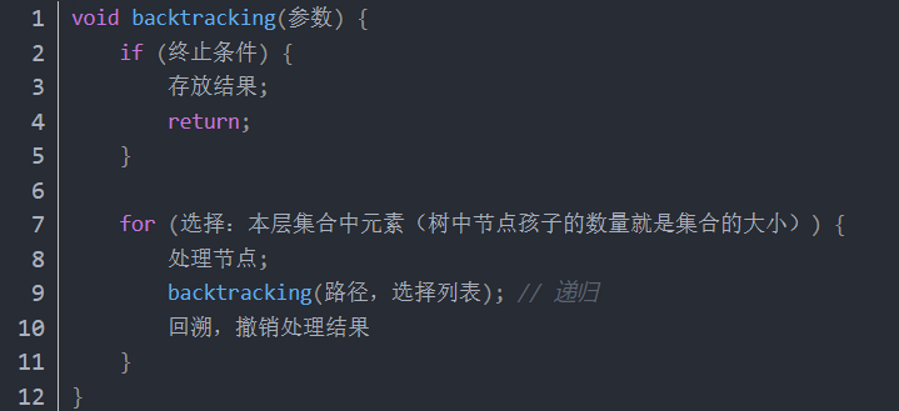
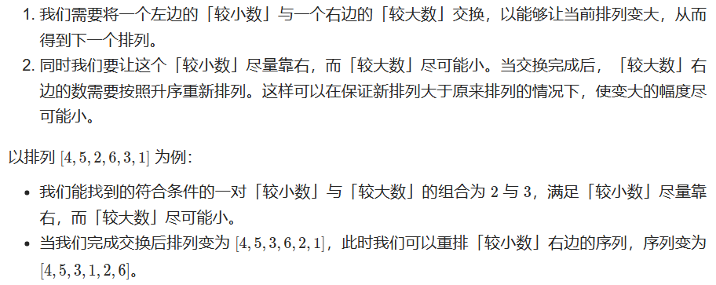
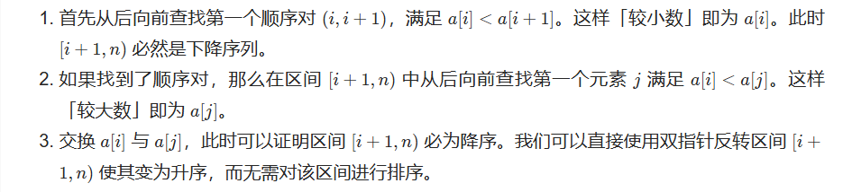

# 回溯算法

参考：https://mp.weixin.qq.com/s/7MXxslDUp_zSiUg9aQOzeq  

回溯的本质是穷举，然后选出我们想要的答案，所以回溯不是什么高效的算法  
判断一个题没有高效做法的情况下，只能通过穷举判断，可以使用回溯

回溯法一般解决如下几种问题：
- 组合问题：N个数里面按一定规则找出k个数的集合
- 切割问题：一个字符串按一定规则有几种切割方式
- 子集问题：一个N个数的集合里有多少符合条件的子集
- 排列问题：N个数按一定规则全排列，有几种排列方式
- 棋盘问题：N皇后，解数独等等
	
回溯三部曲：
- 递归函数参数
- 递归终止条件
- 单层搜索逻辑

## 例题
1. [组合数量](./combine.py)  
   https://leetcode.cn/problems/combinations/

2. [单词搜索](./wordSearch.py)  
   https://leetcode.cn/problems/word-search/

## 重复剪枝的回溯问题

在处理组合或排列问题时，一大难点就是如何处理重复问题  
一个比较通用的处理方法就是对重复的分支进行剪枝

参考：[组合问题如何去重？](https://mp.weixin.qq.com/s?__biz=MzUxNjY5NTYxNA==&mid=2247494732&idx=2&sn=170bb0436e891920ddb5e71710de84ca&chksm=f9a1df1dced6560b1ec005dfa91c3b0b5e83ba827e1c11b66e33056f09ec11a063cf5ca2ec01&scene=178&cur_album_id=1485825793120387074#rd)

## 例题
1. [组合数量2(去重)](./combineSum2.py)  
   https://leetcode.cn/problems/combination-sum-ii/  
   去重条件：  
   candidates = [1,1,2,5,6,7,10], target = 8  
   组合首先加入第二个1的时候，不能再加入第一个1，否则就会重复  
   因此，去重条件为：  
   > if i > 0 and a[i] == a[i-1] and i > index: continue

2. [字符串排列](./permutation.py)  
   https://leetcode.cn/problems/zi-fu-chuan-de-pai-lie-lcof/  
   思路：  
   和全排列的区别就是从数字换成了字符串，关键在于要进行去重操作  
   去重条件：
   s = ['aab']   
   组合内已有一个a的时候，后面的a便不在进入回溯，否则就会重复  
   因此，去重条件为：  
   > if i > 0 and s[i] == s[i-1] and not used[i-1]: continue

   优化思路：  
   - 时间复杂度：O(n*n!)，每个排列长度n，需要O(n)生成，共有n!个排列
   - 空间复杂度：O(n)，需要O(n)的栈空间来进行回溯  
   可以进行空间复杂度优化，避免栈空间的使用，达到常数空间复杂度O(1)，参考下一道例题

3. [下一个排列](./nextPermutation.py)  
   https://leetcode.cn/problems/next-permutation/  
   思路：  
   若当前排列不是最大排列，我们要让排列变大，且变大的尽可能小
   
   
