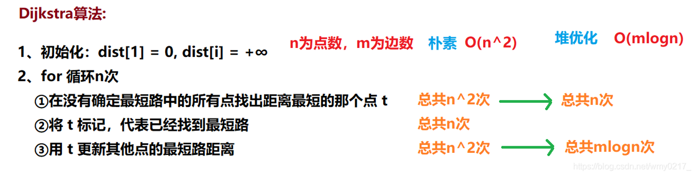
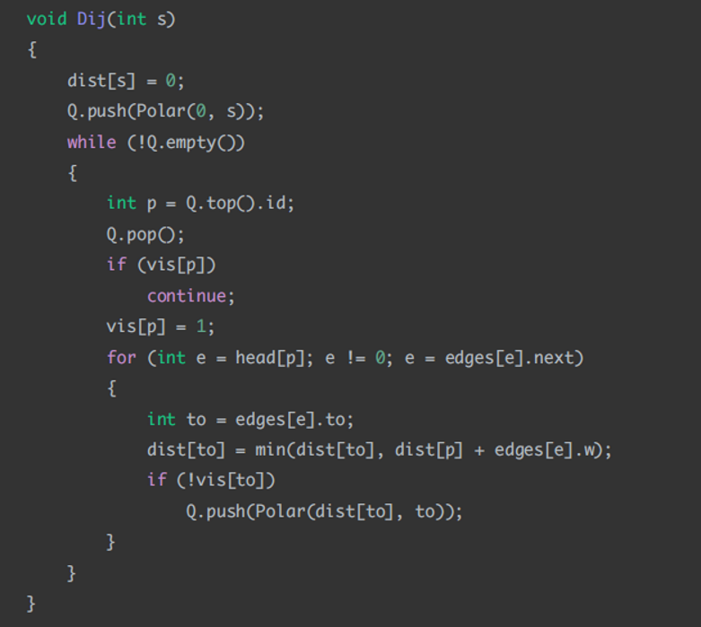
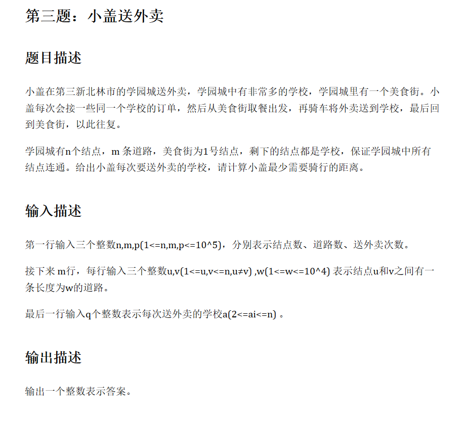

# 图相关题目

## 最短路算法

### Dijkstra算法
适用于没有负边的图  
基于贪心的思想，通过n次循环来确定n个点到七点的距离  

Dijkstra算法可以进行堆优化  
每次找到一个确定一个点后，每次更新都选剩下为确定点中dist最小的结点去更新，直到所有结点都确定。  
这里通过一个优先队列来找到当前距离起点最短且没有确定最短路的那个点。  

### 例题

1. [dijk例题(elm笔试)](./dijk_elm.py)
  
  
  思路：  
  每次都要从美食街出发，去往某个学校送餐  
  美食街为源节点，求每个学校的单源最短路，因此使用djikstra算法

2. [didi笔试](./dijk_didi.py)  
   给定一个n×m的棋盘，棋盘有黑色和白色两种格子，黑色用1标记，白色用0标记  
   一个agent，从棋盘的(1,1)位置出发，走到棋盘(n,m)位置，可以上下左右任意移动  
   请问，该agent途径的黑格的数量最小是多少。
   > 样例  
   输入：第一行n, m 第二行开始输入棋盘  
   5 3  
   0 1 0  
   0 0 1  
   1 0 1  
   1 1 0  
   0 1 0  
   输出：1

   思路：
   看起来很像是一个DP的题，但是因为agent可以四个方向前进，所以不满足子问题的递推关系
   尝试使用dfs求解，但感觉无法确定到底哪个格子可以达到停止条件。
   因此，使用djikstra算法，基于贪心的思想依次确定每个位置的最短路(黑格子数量)，时间复杂度O(m*n*log(m)*log(n)).
